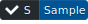
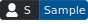
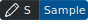
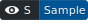
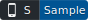
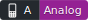

ifndef::target-release[]
:sectnums:
:target-sample:
:full-width: width='100%',align="center"
:half-width: width='50%'
:half-size: width='50%'
:thumbnail: width='60'
:full-page: width='100%'
:half-page: width='50%'
:dialog-page: width='30%'
:list-menu: width='25%'
endif::[]

:Analog-inc: Analog inc.
:link-Analog-inc-url: https://analog-inc.com/
:link-github-repository: https://github.com/Analog-inc/asciidoctor-action-sample
:link-CC-BY-SA-4_0-url: http://creativecommons.org/licenses/by-sa/4.0/
:CC-BY-SA-4_0: クリエイティブ・コモンズ 表示 - 継承 4.0 国際 ライセンス (CC BY-SA 4.0)
:CC-BY-SA-4_0_EN: Creative Commons Attribution-ShareAlike 4.0 International License (CC BY-SA 4.0)

:Analog-inc-url-link: link:{Analog-inc-url}[{Analog-inc}]
:github-repository-link: link:{github-repository}[Github repository]
:CC-BY-SA-4_0-url-link: link:{CC-BY-SA-4_0-url}[{CC-BY-SA-4_0}]
:CC-BY-SA-4_0-url-link-en: link:{CC-BY-SA-4_0-url}[{CC-BY-SA-4_0_EN}]

:CC-BY-SA-4_0-png: image:https://i.creativecommons.org/l/by-sa/4.0/88x31.png[Creative Commons License , opts=inline]

// 権限アイコン
:icon-sample-check: 
:icon-analog-check: 
:icon-sample-user: 
:icon-analog-user: 
:icon-sample-write: 
:icon-analog-write: 
:icon-sample-read: 
:icon-analog-read: 
:icon-sample-smartphone: 
:icon-analog-featurephone: 

// ロール名称
:name-role-sample: サンプルロール
:name-role-analog: Aalogロール

// 固有名詞と指示詞
:name-role-sample-user: {name-role-h}のユーザー
:name-role-analog-user: {name-role-p}のメンバー
