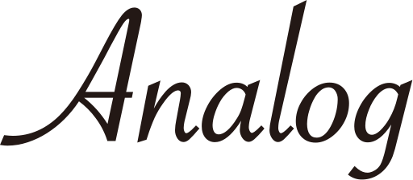

// ドキュメント仕様
:asciidoctor:
:doctype: book
:lang: ja
:icons: font
:encoding: utf-8
:backend: html5
:docinfo: shared
// 画像を埋め込み
:data-uri:
// セクションにアンカーを作成
:sectanchors:
// セクションにリンクを作成
:sectlinks:
// 章番号を付けるか。属性を定義しておくだけで章番号が付けられる。
:sectnums:
// セクションのナンバリングレベルを設定
:sectnumlevels: 6
// ソースコードをハイライトする。
:source-highlighter: coderay
:target-sample:

ifndef::target-release[]
include::define-literal.adoc[]
endif::[]

= 本ドキュメント記載のルール

== 統一した文言と正しい定義について

define-literal.adocに定義ずみの項目については、本文中に直書きすることなく定義を参照して利用するようお願いします。

define-literal.adocに定義された情報は「\{name-role-sample}」のように記載することで「{name-role-sample}」と出力したり、
定義された画像として「\{icon-sample-user}」のように記載することで「{icon-sample-user}」と出力することができます。

[.accordion.source]
----
define-literal.adocに定義された情報は「\{name-role-sample}」のように記載することで「{name-role-sample}」と出力したり、
定義された画像として「\{icon-sample-user}」のように記載することで「{icon-sample-user}」と出力することができます。
----

[IMPORTANT]
.[.red.big]#*用語定義のお願い*#
====
過去の例では表現ゆれの修正に数週間かかるなど、マニュアルのリリースに対して大きなコストがかかることがありました。 +
AscciDocの便利な機能を利用してコスト削減と品質の向上への協力をお願いします。
====

== セクションタイトルのレベルについて

asciidocはヘッダー(見出し)の扱いが厳格な文書形式です。 +
また多くの人が同時に修正しやすくGitでのマージ等が低コストで行えるように、
レベル2のヘッダーごとにインクルードによるファイルの分割を行ってください。 +
また、分割したファイルでは原則レベル3以降のヘッダーを利用し文書の構造化に努めてください。

[.accordion.source]
----
[[include]]
=== 参照先の章の名称
include::include.adoc[]
----

インクルードするファイルのレベルは「leveloffset」を利用して以下の記載をすると揃えることができます。

[.accordion.source]
----
include::include.adoc[leveloffset=+2]
----

== 出力設定について

AsciiDocではifdefディレクティブを利用した簡易的な出力制御が可能です。 +
本ドキュメントでは主に以下の定義を利用して状況や対象者によって以下のように出力を切り替えています。

[.accordion.source]
----
\ifdef::backend-html5[]
出力内容
\endif::[]
----

出力フォーマットによる定義::
本項目は出力対象のフォーマットによって異なる値を利用する場合に利用しています。 +
本項目はAsciidocterにて定義されている項目となります。
backend-html5:::
HTML出力時に有効になります。
backend-pdf:::
PDF出力時に有効になります。
プレビューとビルドを分離する定義::
本項目はドキュメント記載時のプレビューと実際のコンバート処理を分離する場合に利用しています。 +
主に、定義を記載したインクルードをかくファイルで行うかの判定に利用しています。 +
本項目は独自定義項目です。
target-release:::
自動での出力時に有効になります。「.github/workflows/asciidoc.sh」内で指定されます。
権限に関する定義::
本項目は各ユーザーに適した内容を出力するために利用しています。 +
自動での出力時に有効になります。「.github/workflows/asciidoc.sh」内で指定されます。 +
本項目は独自定義項目です。
target-sample:::
{name-role-h}向けの出力を行うときに利用します。 +
「.github/workflows/asciidoc.sh」内で出力ファイル毎に指定されます。
target-analog:::
{name-role-p}向けの出力を行うときに利用します。 +
「.github/workflows/asciidoc.sh」内で出力ファイル毎に指定されます。

== 画像について

画像はその対象やフォーマット毎のルールや、利用時のルールがあります。

=== 作成方法

作成方法は各画像の格納先を参照して下さい。
ifdef::target-release[]
(参照 : <<IMAGE-MANAGEMENT>>)
endif::[]

=== 記述方法

==== ブロック

.ブロック画像

[.accordion.source]
----
.ブロック画像

----

画像の指定には定義を利用したサイズルールがあります。 +
定義を利用することで、全てのサイズを統一することが可能です。

[.accordion]
====
.サイズの記載
[%header,cols="2,2,3"]
|===
|対象 |定義 | 備考
|外部ドキュメントの貼り付け |full-width | センタリングも行います。
|サムネイル |thumbnail |
|フルサイズの画面幅 |full-page |
|ダイアログのみの画像 |dialog-page |
|===
====

==== インライン

インライン {icon-analog-write} で表示

[.accordion.source]
----
インライン {icon-analog-write} で表示
----

ifdef::backend-html5[]
==== VIDEO
ビデオも利用できますが、PDFに埋め込むことはできません。

.ビデオサンプル
video::images/video/sample.mp4[{full-page}]

[.accordion.source]
----
.ビデオサンプル
video::images/video/sample.mp4[{full-page}]
----

endif::[]

== AsciiDoc記述方法と本ドキュメント推奨の記載方法

=== 表の書き方

普段の利用でMarkdownより大きな利便性を感じる場面は表の扱いです。 +
ここでは本ドキュメントで利用している記載法を紹介します。

.複雑な表の扱い
[%header,cols="1,2,3"]
|===
|TH　サイズ1 |TH　サイズ2 |TH　サイズ3

<|<で左寄せ R1C1
^|^で中央寄せ R1C2
>|>で右寄せ R1C3

h|hで個別のヘッダ
|AsciiDoc記法で改行→
|セル内で +
改行

|TD
|AsciiDoc記法のリスト→
<a|
* [.cellsfont]#<で左寄せを明示#
* [.cellsfont]#aでAsciiDoc記法を許容#
* [.cellsfont]#[.cellsfont]#内容#にてフォントをテーブルと合わせる#

.3+|.n+縦に結合 +
|TD
|TD

2+|n+横に結合

|TD
|結合されたカラムの定義はしません

3+a|
[.cellsfont]#aで内部にテーブル#
[%header,cols="1,3"]
!===
![.cellsfont]#no.# ![.cellsfont]#内容#
^![.cellsfont]#1#
![.cellsfont]#ただしセパレータを\!にかえる#
!===
　 +
|===

[.accordion.source]
----
.複雑な表の扱い
[%header,cols="1,2,3"]
|===
|TH　サイズ1 |TH　サイズ2 |TH　サイズ3

<|<で左寄せ R1C1
^|^で中央寄せ R1C2
>|>で右寄せ R1C3

h|hで個別のヘッダ
|AsciiDoc記法で改行→
|セル内で +
改行

|TD
|AsciiDoc記法のリスト→
<a|
* [.cellsfont]#<で左寄せを明示#
* [.cellsfont]#aでAsciiDoc記法を許容#
* [.cellsfont]#[.cellsfont]#内容#にてフォントをテーブルと合わせる#

.3+|.n+縦に結合 +
|TD
|TD

2+|n+横に結合

|TD
|結合されたカラムの定義はしません

3+a|
[.cellsfont]#aで内部にテーブル#
[%header,cols="1,3"]
!===
![.cellsfont]#no.# ![.cellsfont]#内容#
^![.cellsfont]#1#
![.cellsfont]#ただしセパレータを\!にかえる#
!===
　 +
|===
----

.外部CSVファイルを利用したテーブル
[format="csv", options="header,footer" cols=",,"]
|===
include::table.csv[]
|===

[.accordion.source]
----
.外部CSVファイルを利用したテーブル
[format="csv", options="header,footer" cols=",,"]
|===
\include::table.csv[]
|===
----
=== ロール指定による文字のスタイル指定

以下のようにロールを利用してスタイルを適用することができます。

* 指定なし
* *強調によるボールド*
* [.big]#大きめ文字#
* [.red]#赤#
* [.orange.big]#オレンジ大きめ文字#
* [.navy.big]#*青の大きめ文字ボールド*#
* [.cellsfont]#テーブル内と同じ文字#
* [.cellsfont.red]#テーブル内の赤字#

[.accordion.source]
----
* 指定なし
* *強調によるボールド*
* [.big]#大きめ文字#
* [.red]#赤#
* [.orange.big]#オレンジ大きめ文字#
* [.navy.big]#*青の大きめ文字ボールド*#
* [.cellsfont]#テーブル内と同じ文字#
* [.cellsfont.red]#テーブル内の赤字#
----

=== 注釈等

注釈はアイコンが左側に表示されるスタイルです。
変更容易性や表現の幅を考慮しブロック形式で記載することをお勧めします。

[NOTE]
.[.navy.big]#*NOTE*#
====
インフォメーションマークが出力されます。 +
補足となる内容を記載してください。
====

[.accordion.source]
----
[NOTE]
.[.navy.big]#*NOTE*#
====
インフォメーションマークが出力されます。 +
補足となる内容を記載してください。
====
----

[TIP]
.[.big]#*TIP*#
====
電球マークが出力されます。 +
少し高度な利用方法などを記載してください。
====

[.accordion.source]
----
[TIP]
.[.big]#*TIP*#
====
電球マークが出力されます。 +
少し高度な利用方法などを記載してください。
====
----

[WARNING]
.[.orange.big]#*WARNING*#
====
三角オレンジの注意マークが出力されます +
システムを利用する上で不用意にデータの閲覧ができなくなるなどの +
問題を回避する方法を記載してください。
====

[.accordion.source]
----
[WARNING]
.[.orange.big]#*WARNING*#
====
三角オレンジの注意マークが出力されます +
システムを利用する上で不用意にデータの閲覧ができなくなるなどの +
問題を回避する方法を記載してください。
====
----

[IMPORTANT]
.[.red.big]#*IMPORTANT*#
====
丸い赤の警告マークが出力されます +
システムを利用する上でセキュリティーリスクなどを記載してください。
====

[.accordion.source]
----
[IMPORTANT]
.[.red.big]#*IMPORTANT*#
====
丸い赤の警告マークが出力されます +
システムを利用する上でセキュリティーリスクなどを記載してください。
====
----

[CAUTION]
.[.crimson.big]#*CAUTION*#
====
現在ある不具合やバグ、明らかな矛盾点など記載してください。
====

[.accordion.source]
----
[CAUTION]
.[.crimson.big]#*CAUTION*#
====
現在ある不具合やバグ、明らかな矛盾点など記載してください。
====
----

=== リスト

==== 順序無しリストのネスト

* レベル１
** レベル２
*** レベル３
** レベル２

[.accordion.source]
----
* レベル１
** レベル２
*** レベル３
** レベル２
----

==== 順序ありリストのネスト

. 手順１
. 手順２
.. 手順２a
.. 手順２b
. 手順３

[.accordion.source]
----
. 手順１
. 手順２
.. 手順２a
.. 手順２b
. 手順３
----

==== チェックリスト

リーフレットなどを作成する場合はご利用ください。

- [*] チェック済みの要素
- [x] これもチェック済みの要素
- [ ] 未チェックの要素

[.accordion.source]
----
- [*] チェック済みの要素
- [x] これもチェック済みの要素
- [ ] 未チェックの要素
----

=== 改ページ
----
<<<
----

=== コメントアウト

==== インライン

//はコメントアウトになり出力されません。
----
//はコメントアウトになり出力されません。
----

==== ブロック

////
ここにコメント
////

----
////
ここにコメント
////
----

=== ラベル

辞書形式に利用します。

第一項:: 第一項の定義
二条::: 第一項二条の定義
第二項:: 第二項の定義

[.accordion.source]
----
第一項:: 第一項の定義
第一項二条::: 第一項二条の定義
第二項:: 第二項の定義
----

=== 水平罫線

水平罫線は以下のように記載します。

'''

[.accordion.source]
----
'''
----

=== 記号の記載

一部の記号は記載時にリプレースやエスケープを行う必要があります。

例えば「{vbar}」はリプレースとして「\{vbar}」と記載を行います。
また、テーブル内で別のセパレーターとして「!」と利用する場合などはエスケープとして「/!」とすることで出力できます。

[.accordion.source]
----
例えば「{vbar}」はリプレースとして「\{vbar}」と記載を行います。
また、テーブル内で別のセパレーターとして「!」と利用する場合などはエスケープとして「/!」とすることで出力できます。
----

以下はリプレースを行うべき記号や文字のリストとなります。

[.accordion]
.リプレース対象の定義済み文字 ^[1][2][3]^
====
[width="75%", cols="^4m,^3l,^3"]
|===
|Attribute name |Replacement text |Appearance

|blank
e|nothing
|{empty}

|empty
e|nothing
|{empty}

|sp
e|single space
|{sp}

|nbsp
|&#160;
|{nbsp}

|zwsp^[4]^
|&#8203;
|{zwsp}

|wj^[5]^
|&#8288;
|{wj}

|apos
|&#39;
|{apos}

|quot
|&#34;
|{quot}

|lsquo
|&#8216;
|{lsquo}

|rsquo
|&#8217;
|{rsquo}

|ldquo
|&#8220;
|{ldquo}

|rdquo
|&#8221;
|{rdquo}

|deg
|&#176;
|{deg}

|plus
|&#43;
|{plus}

|brvbar
|&#166;
|&#166;

|vbar
|\|
|{vbar}

|amp
|&
|&

|lt
|<
|<

|gt
|>
|>

|startsb
|[
|[

|endsb
|]
|]

|caret
|^
|^

|asterisk
|*
|*

|tilde
|~
|~

|backslash
|\
|\

|backtick
|`
|`

|two-colons
|::
|::

|two-semicolons
|;;
|;;

|cpp
|C++
|C++
|===

^[1]^ いくつかの置換はUnicode文字ですが、他の置換は数値の文字参照です(例えば、\&#34;)。
これらの文字参照は、Unicode文字の使用がAsciiDocの構文に干渉したり、レンダラー（すなわちブラウザ）を混乱させる可能性がある場合に使用されます。
参照をレンダラーが理解できるものに変換するのはコンバータ次第です（マニュアルページとPDFコンバータの両方が処理するもの）。

^[2]^ Asciidoctor は、定義済みの属性を再割り当てすることを妨げるものではありません。
しかし、出力形式が異なるエンコーディング方式の使用を必要としない限り、それらを読み取り専用として扱うのが最善です。
これらの属性は、コンテンツとプレゼンテーションを切り離すための効果的なツールです。

^[3]^ Asciidoctorでは、HTMLで定義されている名前付き文字参照（別名：名前付き実体）のいずれかを使用することができます（例：\&euro; resolves to &euro;）。
しかし、名前付き文字参照を使用すると、PDFなどの非HTML出力を生成する際に問題が発生することがあります。
こ れ ら の名前を解決するために必要な参照テーブルが定義されていない可能性があるからです。私たちの推奨事項は、XML で定義されているもの（すなわち lt ・ gt ・ amp ・ quot ・ apos）を除いて、名前付き文字参照の使用を避けることです。
その代わりに、数値の文字参照を使用してください。

^[4]^ ゼロ幅空間(ZWSP)は、必要に応じて長い単語を分割できる場所を示すUnicodeのコードポイントです。

^[5]^ ワードジョイナー（WJ）は、その位置での改行を防ぐUnicodeのコードポイントです。
====

=== ダイアグラム
Asciidoctorではダイアグラムを記載することができますが、生成画像はプレビューできません。

==== ditaaで記述するダイアグラム

アスキーアートのような表現で記載が可能です。

[.accordion]
====
[ditaa, diagram-sample, svg]
....
                   +-------------+
                   | Asciidoctor |-------+
                   |   diagram   |       |
                   +-------------+       | PNG out
                       ^                 |
                       | ditaa in        |
                       |                 v
 +--------+   +--------+----+    /---------------\
 |        | --+ Asciidoctor +--> |               |
 |  Text  |   +-------------+    |   Beautiful   |
 |Document|   |   !magic!   |    |    Output     |
 |     {d}|   |             |    |               |
 +---+----+   +-------------+    \---------------/
     :                                   ^
     |          Lots of work             |
     +-----------------------------------+
....

[ditaa, diagram-format, svg]
....

          +-----+
          |{d}  |
          |     |
          |     |
          +-----+

          +-----+
          |{s}  |
          |     |
          |     |
          +-----+

          +-----+
          |{io} |
          |     |
          |     |
          +-----+

          Color codes
      /----------+----------\
      |cRED 赤    |cBLU 青    |
      +----------+----------+
      |cGRE 緑    |cPNK ピンク  |
      +----------+----------+
      |cBLK 黒    |cYEL 黄色   |
      \----------+----------/

      /-----------------\
      | Things to do    |
      | cGRE            |
      | o Cut the grass |
      | o Buy jam       |
      | o Fix car       |
      | o Make website  |
      \-----------------/

....
====

==== PlantUMLで記述するダイアグラム

UMLを記述する場合はPlantUMLがおすすめ。 +
多彩なUMLを気軽に記述できる。

[.accordion]
====
[plantuml, diagram-classes, svg]
....
class BlockProcessor
class DiagramBlock
class DitaaBlock
class PlantUmlBlock

BlockProcessor <|-- DiagramBlock
DiagramBlock <|-- DitaaBlock
DiagramBlock <|-- PlantUmlBlock
....

[plantuml, diagram-sequence, svg]
....
actor Bob #red
' The only difference between actor
'and participant is the drawing
participant Alice
participant "I have a really\nlong name" as L #99FF99
/' You can also declare:
   participant L as "I have a really\nlong name"  #99FF99
  '/

Alice->Bob: Authentication Request
Bob->Alice: Authentication Response
note over Alice, Bob #FFAAAA: This is displayed\n over Bob and Alice.
note over Alice: ノートだよ
Bob->L: Log transaction
Alice->Alice: This is a signal to self.\nIt also demonstrates\nmultiline \ntext
....
====
